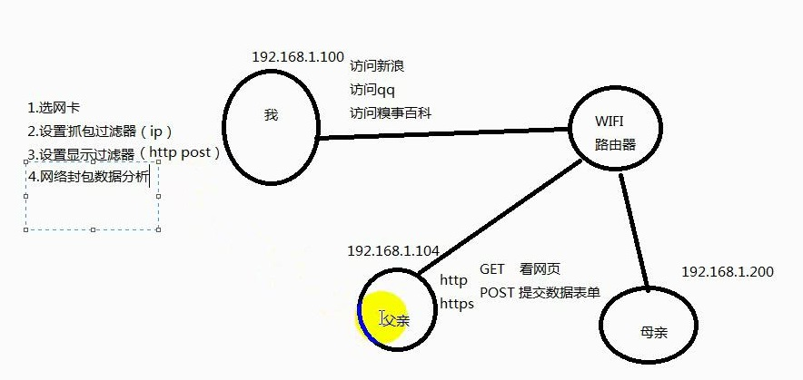

# wireshark

## 抓包流程

1. 选网卡
2. 设置抓包过滤器
3. 设置显示过滤器
4. 网络封包数据分析

## 设置抓包过滤

**语法**

`protocol $ direction $ hosts $ value $logical operations $ other expression`

**示例**

`ip src host 192.168.1.100`

`tcp dst port 8080`

### protocol

可能值: ether, fddi, ip, arp ,rarp, tcp and udp

### direction

可能值: src, dst, src and dst, src or dst

### Host(s)

可能值: net, port, host, portrange

### 逻辑运算 logical operations

可能值: not, and, or

## 设置显示过滤

**语法**

`protocol.string1.string2 $ comparison operation $ value $ logical operation $ other expression`

**示例**

`ip.src == 192.168.1.100`

`tcp.port == 80`

`http.request.method == post`

## 网络封包分析

分析网络数据包

- ether
- IP
- TCP
- HTTP

## 参考

- [linux-sys.zh]
- wifi密码破解-Linux工具篇 虚竹 ITCAST