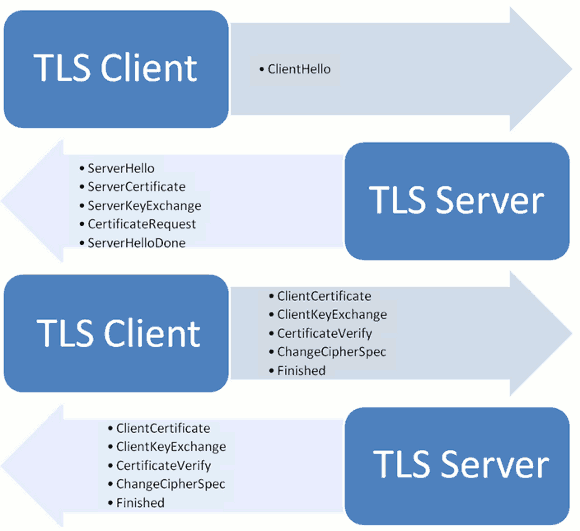

# SSL/TLS协议

TLS是SSL的升级版

## SSL/TLS的作用

**未使用SSL/TLS的HTTP**

1. 窃听风险（eavesdropping）：第三方可以获知通信内容。
1. 篡改风险（tampering）：第三方可以修改通信内容。
1. 冒充风险（pretending）：第三方可以冒充他人身份参与通信。

**SSL/TLS作用**

1. 所有信息都是加密传播，第三方无法窃听。
1. 具有校验机制，一旦被篡改，通信双方会立刻发现。
1. 配备身份证书，防止身份被冒充。

## 基本运行过程

1. 客户端向服务器端索要公钥，公钥放在证书中
1. 客户端用公钥加密信息
1. 服务器收到密文后用私钥解密

**公钥加密计算量太大问题解决**

每一次对话（session），客户端和服务器端都生成一个"对话密钥"（session key），用它来加密信息。
由于"对话密钥"是对称加密，所以运算速度非常快，而服务器公钥只用于加密"对话密钥"本身，这样就减少了加密运算的消耗时间。

**最终流程**

1. 客户端向服务器端索要并验证公钥。
1. 双方协商生成"对话密钥"。
1. 双方采用"对话密钥"进行加密通信。

## 握手详细过程

### 客户端请求(ClientHello)

1. 支持的协议版本，比如TLS 1.0版。
1. 一个客户端生成的随机数，稍后用于生成"对话密钥"。
1. 支持的加密方法，比如RSA公钥加密。
1. 支持的压缩方法

注意：TLS加入Server Name Indication，方便虚拟主机

### 服务端相应(ServerHello)

1. 确认使用的加密通信协议版本，比如TLS 1.0版本。如果浏览器与服务器支持的版本不一致，服务器关闭加密通信。
1. 一个服务器生成的随机数，稍后用于生成"对话密钥"。
1. 确认使用的加密方法，比如RSA公钥加密。
1. 服务器证书。

注意：服务器可能要求客户端提供“客户端证书”，如金融机构的USB秘钥

### 客户端回应

客户端验证证书

1. 一个随机数。该随机数用服务器公钥加密，防止被窃听。
1. 编码改变通知，表示随后的信息都将用双方商定的加密方法和密钥发送。
1. 客户端握手结束通知，表示客户端的握手阶段已经结束。这一项同时也是前面发送的所有内容的hash值，用来供服务器校验。

### 服务器回应

服务器收到客户端的第三个随机数pre-master key之后，计算生成本次会话所用的"会话密钥"

1. 编码改变通知，表示随后的信息都将用双方商定的加密方法和密钥发送。
1. 服务器握手结束通知，表示服务器的握手阶段已经结束。这一项同时也是前面发送的所有内容的hash值，用来供客户端校验

## 参考

- [RFC5246](http://tools.ietf.org/html/rfc5246)
- [阮一峰SSL/TLS讲解](http://www.ruanyifeng.com/blog/2014/02/ssl_tls.html)
- [Wireshark分析HTTPS请求包](http://blog.jobbole.com/48369/)